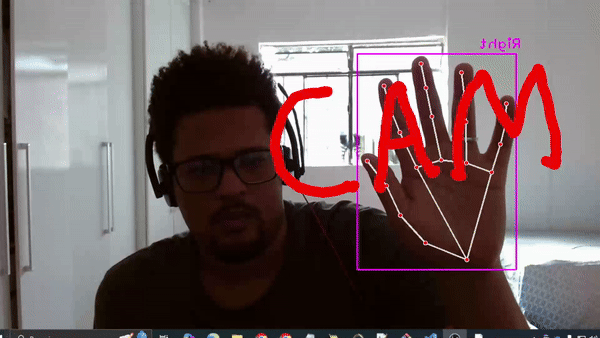

# DrawWithMotion 🖌️  
**Controle sua criatividade no ar!**  

O **DrawWithMotion** é um projeto de visão computacional que permite ao usuário desenhar virtualmente no espaço usando gestos das mãos capturados pela câmera. Utilizando técnicas modernas de rastreamento de mãos, você pode criar desenhos em tempo real sem a necessidade de dispositivos adicionais como tablets ou mouses.  

---

## 📖 Sobre o Projeto  
O **DrawWithMotion** explora o potencial das bibliotecas de visão computacional para criar uma interface intuitiva e acessível.  
O sistema identifica a posição das articulações da mão e interpreta gestos como comandos para desenhar, apagar ou suspender o desenho. Ele combina processamento de imagem com interatividade criativa, oferecendo uma experiência fluida e responsiva.  

---

## 🚀 Principais Funcionalidades  

1. **Desenho no ar**: Use o dedo indicador como uma "caneta virtual" para traçar linhas na tela.  
2. **Apagar o desenho**: Levante três dedos para limpar a tela de maneira rápida.  
3. **Suspender o desenho**: Alterne para outros gestos para pausar a funcionalidade de desenho.  
4. **Atualização em tempo real**: Experiência suave e responsiva, ideal para demonstrações ou aplicações artísticas.  

---

## 🛠️ Tecnologias Utilizadas  

- **Python** - Linguagem base para implementação.  
- **OpenCV** - Para captura e manipulação de vídeo e imagens.  
- **cvzone** - Facilita a detecção de mãos e rastreamento de gestos.  

---

## 🎥 Exemplos de Funcionamento  
Abaixo estão algumas demonstrações do **DrawWithMotion** em ação:  

### Desenho no ar  

  

### Apagando o desenho  

  

### Suspensão do desenho  

 

---

## ⚙️ Configuração e Execução  

### Pré-requisitos  
Certifique-se de ter o Python e as bibliotecas necessárias instaladas no seu sistema:  

```bash
pip install opencv-python
pip install cvzone
```

### Como Executar  

1. Clone este repositório ou copie o código para um arquivo Python.  
2. Conecte uma câmera ao computador.  
3. Execute o script Python:  

```bash
python draw_with_motion.py
```

4. Use os seguintes gestos para interagir:  
   - **1 dedo levantado**: Desenhar.  
   - **3 dedos levantados**: Limpar o desenho.  
   - **Outro gesto**: Suspender o desenho.  

---

## 📚 Explicação Técnica  

1. **Inicialização**  
   - O programa utiliza `cv2.VideoCapture` para acessar a câmera.  
   - As dimensões da janela são ajustadas para 1280x720.  

2. **Rastreamento de Mãos**  
   - A biblioteca `cvzone.HandTrackingModule` é usada para detectar as posições das articulações da mão.  
   - A função `detector.fingersUp()` identifica quais dedos estão levantados.  

3. **Interpretação de Gestos**  
   - O código verifica a quantidade de dedos levantados para decidir a ação:  
     - **1 dedo**: Adiciona o ponto atual ao desenho.  
     - **3 dedos**: Reseta o desenho.  
     - **Outro gesto**: Adiciona um ponto neutro (0,0) para pausar o desenho.  

4. **Desenho na Tela**  
   - Os pontos são conectados com linhas utilizando `cv2.line`, criando um traçado contínuo.  
   - O desenho é espelhado horizontalmente (`cv2.flip`) para simular um espelho, melhorando a experiência do usuário.  

---

## 🛠️ Possíveis Melhorias  

1. **Paleta de cores**: Adicionar comandos para alterar a cor do desenho em tempo real.  
2. **Controle de espessura**: Permitir ajustar a largura do traço com base em gestos ou configurações.  
3. **Salvar o desenho**: Implementar uma funcionalidade para salvar o desenho como imagem.  
4. **Mais comandos gestuais**: Expandir os gestos para incluir funcionalidades como desfazer ou refazer.  
5. **Modo multiusuário**: Permitir o desenho colaborativo com mais de uma mão.  

---

## 🖼️ Aplicações Potenciais  

- **Arte digital**: Criar desenhos de maneira única e interativa.  
- **Educação**: Apresentar conceitos de visão computacional de forma prática.  
- **Interatividade**: Demonstrar a integração de tecnologia e criatividade.  

---

## 🤝 Contribuições  

Contribuições são sempre bem-vindas! Para sugerir melhorias, adicionar novas funcionalidades ou reportar problemas, abra uma _issue_ ou envie um _pull request_ neste repositório.  

--- 
